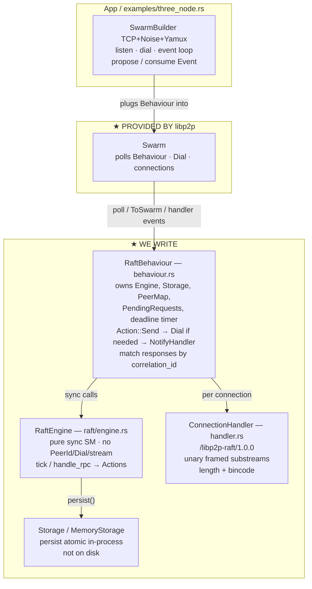
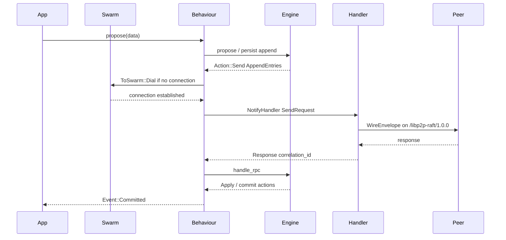

# libp2p-raft

Learning / research crate: a **DIY mini-Raft** exposed as a rust-libp2p **`NetworkBehaviour`**, with a **custom** `ConnectionHandler` and stream protocol `/libp2p-raft/1.0.0`.

> **Not production Raft.** Intentional simplifications: in-memory storage (no disk durability), single-step membership (add/remove one node), simple `next_index` decrement, no OpenRaft.

**Why a custom `ConnectionHandler` instead of `libp2p::request_response`?**  
Learning goal: understand Behaviour ↔ Handler lifecycle, substream framing, and unary RPC plumbing end-to-end. Production code would often compose `request_response`; we hand-roll it on purpose.

**Docs**
- Handler → Behaviour → Engine architecture: [`docs/handler-behaviour-engine-en.md`](docs/handler-behaviour-engine-en.md) (EN) · [`docs/handler-behaviour-engine.md`](docs/handler-behaviour-engine.md) (VI)
- libp2p fundamentals (connection → substream → protocol → Handler): [`docs/libp2p-fundamentals.md`](docs/libp2p-fundamentals.md)
- Phase 1 (engine election + MemoryStorage): [`docs/phase-1.md`](docs/phase-1.md)
- Phase 2 (election over libp2p): [`docs/phase-2.md`](docs/phase-2.md)
- Phase 3 (replication + propose + commit): [`docs/phase-3.md`](docs/phase-3.md)
- Design spec: [`docs/superpowers/specs/2026-07-23-libp2p-raft-design.md`](docs/superpowers/specs/2026-07-23-libp2p-raft-design.md)
- Implementation plan: [`docs/superpowers/plans/2026-07-23-libp2p-raft.md`](docs/superpowers/plans/2026-07-23-libp2p-raft.md)
- Phase 2 plan: [`docs/superpowers/plans/2026-07-27-phase-2-election-over-libp2p.md`](docs/superpowers/plans/2026-07-27-phase-2-election-over-libp2p.md)

---

## Goals

- Learn how `NetworkBehaviour` + `ConnectionHandler` interact under a Swarm
- Map a pure consensus state machine onto libp2p I/O
- Cover mini-Raft: **election (RequestVote) → log replication (AppendEntries) → snapshot → basic membership**

---

## Architecture

### Glossary (libp2p newcomers)

| Term | Meaning here |
|------|----------------|
| **Swarm** | libp2p event loop: dials, accepts connections, polls behaviours |
| **PeerId** | libp2p identity from a **pinned keypair** (do not regenerate) |
| **NodeId** | Raft identity (`u64`), stable in membership config |
| **Connection** | Encrypted multiplexed link Swarm manages between two PeerIds |
| **ConnectionHandler** | Per-connection worker: opens `/libp2p-raft/1.0.0` substreams, reads/writes bytes |
| **NetworkBehaviour** | Swarm-facing logic: owns handlers' commands, emits dials & app events |
| **Unary RPC** | One substream = one request + one response, then close (not a long-lived bi-di session) |
| **Action** | Pure output from `RaftEngine` (e.g. `Send`); Behaviour translates to Dial / NotifyHandler |

### Big picture



**Threading model:** single Swarm event loop. `RaftEngine` is called synchronously from `NetworkBehaviour::poll` — no background consensus thread. Engine is `Send`-friendly state, but not driven on its own task.

**Swarm ownership:** this crate does **not** build or own a Swarm. It only provides `RaftBehaviour` for apps to plug into `SwarmBuilder` (keeps the library transport-agnostic). Swarm construction lives in `examples/` (and your app).

### libp2p provides vs we write

| ★ Provided by **libp2p** | ★ We **write** |
|--------------------------|----------------|
| `Swarm` / `SwarmBuilder` | `RaftBehaviour` |
| TCP / Noise / Yamux | `ConnectionHandler` + `/libp2p-raft/1.0.0` |
| `dial` / `listen_on` / connection events | `WireEnvelope` + codec |
| `NetworkBehaviour` / `ConnectionHandler` **traits** | `RaftEngine` (DIY Raft) |
| Stream multiplexing | `Storage` / `MemoryStorage` |
| | `PeerMap`, `PendingRequest`, examples |

### Layer responsibilities

| Layer | Owns | Does **not** own |
|--------|------|------------------|
| App / Swarm | Transport, listen/dial loop, consuming events | Raft rules |
| RaftBehaviour | Engine, peer map, pending RPCs, deadline wake, Action → network | Election/log algorithm details |
| ConnectionHandler | Open/read/write/close framed substreams | Term, votes, commit index |
| RaftEngine | Term, role, log, membership, logical deadlines | `PeerId`, dial, streams |
| Storage | In-memory hard state + log + snapshot; `persist` is one in-process atomic update | Disk durability / networking |

### Sequence (propose → commit)



Same pattern for **election**: Sleep deadline → `engine.tick` → `Broadcast`/`Send` **RequestVote** → responses → majority → `BecomeLeader` → `Event::RoleChanged`. On leader failure, followers' election timeouts fire and a new election runs (standard Raft); connection loss alone does **not** remove a node from membership.

### Control flows (short)

1. **Timer** — Behaviour deadline timer fires → `engine.tick(now)` → Actions → Behaviour may request **Dial via `ToSwarm`** (engine never dials) → Handler unary RPC → match `correlation_id` → `handle_rpc`.
2. **Propose** — leader `persist` append → AppendEntries to followers → majority `match_index` → commit → `Event::Committed`.
3. **Inbound** — Handler reads request → `handle_rpc` → optional `SendResponse` on same unary RPC.
4. **Failure** — timeout → retry ≤ `rpc_max_retries` → `handle_rpc_failure` + `Event::RpcFailed`. **libp2p connection drop ≠ Raft membership remove**; membership only changes via `propose_membership`.

### Identity & bootstrap

- Raft **`NodeId = u64`**
- Each NodeId is statically mapped for the cluster lifetime to exactly one **`PeerId`** (from a pinned keypair) + seed `Multiaddr`s
- No Kademlia required for MVP — static `SeedPeer { node_id, peer_id, addrs }`
- Configure voting NodeIds **before** the first election timeout

### Protocol

| Item | Choice |
|------|--------|
| Protocol ID | `/libp2p-raft/1.0.0` |
| Framing | `u32 BE length` + bincode |
| RPC model | Unary request/response over a framed substream, then close |
| Envelope | `WireEnvelope { correlation_id, msg }` |
| Messages | RequestVote(+Resp), AppendEntries(+Resp), InstallSnapshot(+Resp) |
| Heartbeat | Empty AppendEntries |
| Snapshot | Sequential unary chunks; on failure **restart from offset 0** (no resume) |
| Not used | Gossipsub for Raft RPCs |

### RaftEngine surface

```text
tick(now)            → TickOutcome { actions, next_deadline }
handle_rpc(from,msg) → Vec<Action>
handle_rpc_failure   → Vec<Action>
propose(data)        → Index          // leader only
propose_membership(AddNode | RemoveNode) → Index
apply_ready()        → committed entries
```

**Actions:** `Send`, `Broadcast` (Behaviour expands to per-peer `Send`), `Apply`, `BecomeLeader|Follower|Candidate`, `SnapshotInstallComplete`.

**Replication:** `next_index` / `match_index`. On reject → **simple decrement**. New followers start with `next_index = leader_last_log_index + 1`, `match_index = 0`.

**Membership:** only one Add **or** Remove at a time; reject while pending. Not joint consensus.

**Storage:** `persist(hard_state, entries)` — one in-process atomic update (teaches the Raft durability *contract*; process restart still loses all state).

### Tick scheduling

Engine holds absolute deadlines. Behaviour resets a deadline timer after state-changing events and calls `tick(now)` **only when due** (no busy-poll every `poll()`).

### Crate layout

```text
src/
  behaviour.rs   # NetworkBehaviour adapter
  handler.rs     # ConnectionHandler
  cluster_config.rs · node_identity.rs
  peer_map.rs · config.rs · error.rs
  protocol/      # messages, codec, upgrade
  raft/          # engine, types, log, snapshot, membership
  storage/       # trait + MemoryStorage
  bin/
    raft-node.rs # deployable single-node binary
config/
  cluster.local.toml   # 3-node localhost topology
  cluster.docker.toml  # 6-node Docker static IPs
examples/
  three_node.rs  # in-process 3-node demo
  echo_two_peers.rs
scripts/
  run-cluster.ps1 · run-cluster.sh
tests/
  engine_*.rs · cluster_config.rs
```

### Running a multi-node cluster

**One TOML file** defines voters + all nodes (`id`, `host`, `port`). Each process only needs `NODE_ID`.

| Target | Config | Command |
|--------|--------|---------|
| Local 3-node | `config/cluster.local.toml` | `.\scripts\run-cluster.ps1` |
| Docker 6-node | `config/cluster.docker.toml` | `docker compose up --build` |
| Single node | same config | `NODE_ID=1 cargo run --bin raft-node` |

List node ids from config: `cargo run --bin raft-node -- --list-nodes`

Legacy env (`RAFT_PEERS`, `RAFT_VOTERS`) still works if no cluster file is present.

### Implementation phases

| Phase | Deliverable |
|-------|-------------|
| 0 | Scaffold + correlated echo RPC (2 peers) |
| 1 | Engine election + MemoryStorage (unit tests) |
| 2 | Wire votes; 3-node elects leader |
| 3 | AppendEntries + propose + commit |
| 4 | Snapshots |
| 5 | Membership add/remove one-at-a-time |

---

## Status

Phases 1–3 implemented: election over libp2p, log replication, `propose`, and `Event::Committed` (`three_node` commits a command). Next: Phase 4 snapshots.

## License

MIT OR Apache-2.0 (intended)
