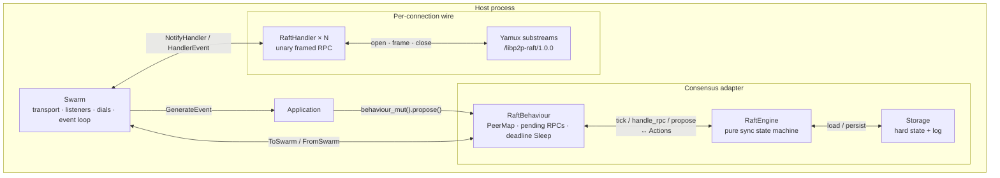
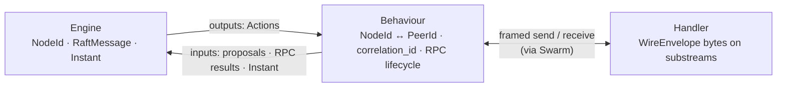

# Architecture of a Mini-Raft Consensus Layer over rust-libp2p

## Abstract

This note describes the architecture of *libp2p-raft*, a research implementation that embeds a simplified Raft consensus state machine inside a rust-libp2p `NetworkBehaviour`. The design separates a pure, synchronous consensus engine from an asynchronous networking adapter and a per-connection stream handler. Consensus messages are carried as unary framed RPCs on the application protocol `/libp2p-raft/1.0.0`, multiplexed over authenticated libp2p connections. The present document states the relevant background in distributed consensus and peer-to-peer networking, then maps those concepts onto the module boundaries, wire format, control paths, identity model, and deliberate simplifications of the implementation. The work is intended for study and experimentation rather than production deployment.

## 1. Introduction

Replicated state machines require a consensus protocol so that a set of processes can agree on a single ordered history of commands despite crashes and transient network partitions. Raft [1] decomposes this problem into leader election, log replication, and safety invariants that are comparatively amenable to implementation and testing. Concurrently, libp2p provides a modular networking stack—transport upgrades, authenticated identities, and stream multiplexing—within which application protocols are expressed as behaviours and connection handlers rather than as raw sockets.

*libp2p-raft* investigates the composition of these two layers. A DIY mini-Raft engine is owned by a `NetworkBehaviour` that never performs I/O itself; byte-level framing occurs in a custom `ConnectionHandler`. The library does not construct or own a `Swarm`: host applications assemble TCP, Noise, and Yamux through `SwarmBuilder` and plug in `RaftBehaviour`. Explicit goals include (i) clarifying Behaviour–Handler lifecycle and unary substream RPC, and (ii) keeping consensus logic free of `PeerId`, dialing, and stream handles so that the engine can be exercised deterministically in unit tests.

The implementation is intentionally incomplete relative to production systems. Persistence is in-memory only; replication rejection uses simple `next_index` decrement; membership is limited to single-node add/remove in the design (without joint consensus); and snapshots are only partially wired. The architectural interest lies in the layering, not in claiming full Raft fidelity.

## 2. Background

### 2.1 Raft consensus

Raft maintains a replicated log so that every server applies the same sequence of commands to a deterministic state machine. Time is partitioned into monotonically increasing *terms*. At any moment a server is a *follower*, *candidate*, or *leader*. Followers are passive; candidates solicit votes after an election timeout; the leader accepts client writes, appends them locally, and replicates them via `AppendEntries` RPCs. Empty `AppendEntries` messages serve as heartbeats that suppress elections.

A candidate wins leadership by obtaining votes from a majority of the configured voters. Each server grants at most one vote per term, and only if the candidate’s log is at least as up-to-date as its own. Because any two majorities intersect, at most one leader can be elected in a given term (*election safety*). Log consistency is enforced by `prev_log_index` / `prev_log_term` checks: followers reject mismatched prefixes, and leaders retreat their per-follower `next_index` until a common prefix is found. An entry becomes committed once a majority has stored it under Raft’s commitment rules; the leader advances `commit_index` and informs followers so that all replicas apply the same prefix (*state machine safety*). Together with *leader completeness*—new leaders must contain all previously committed entries—these invariants ensure that committed history is never lost under the protocol’s failure assumptions.

Persistent *hard state* comprises `current_term`, `voted_for`, and the log. Volatile state includes `commit_index`, `last_applied`, and, on leaders, `next_index` and `match_index`. Hard state must be written atomically before a server grants a vote or acknowledges replication that depends on that state; otherwise a crash between partial writes can violate the one-vote-per-term invariant.

### 2.2 rust-libp2p networking

In rust-libp2p, a *Swarm* is the top-level event loop. It owns the transport, listeners, dials, and active connections, and it polls a single application `NetworkBehaviour` (or a composition of behaviours). Nodes are identified by a cryptographic *PeerId* derived from a keypair; reachability is expressed by *multiaddrs*. A typical transport stack upgrades a TCP byte stream with Noise authentication and encryption, then multiplexes many logical *substreams* with Yamux. Application protocols negotiate a protocol identifier (for example `/libp2p-raft/1.0.0`) on each substream via multistream-select.

Responsibilities are split along a peer-wide versus per-connection axis. A `NetworkBehaviour` decides *what* should happen—when to dial, which peers to address, how global protocol state evolves—and emits `ToSwarm` commands such as dial requests, handler notifications, and application events. A `ConnectionHandler` manages *how* a single connection speaks the protocol: opening and accepting substreams, framing bytes, and notifying the behaviour of completed exchanges. The Swarm mediates all communication; behaviour and handler never invoke each other directly.

Because multiplexed substreams are cheap relative to new transport connections, a common pattern is *unary* RPC: open a substream, exchange one request and one response, then close. Concurrent RPCs proceed on independent substreams without head-of-line blocking across unrelated exchanges, while the long-lived connection amortizes TCP and Noise setup.

### 2.3 Consensus as a pure state machine over an RPC adapter

A practical implementation concern is the separation of the consensus state machine from the networking substrate (ports-and-adapters / hexagonal architecture). The engine consumes logical inputs—timer ticks, inbound RPCs identified by Raft `NodeId`, client proposals—and produces *actions* such as “send this message to node *k*” or “apply these committed entries.” It performs no dialing, serialization, or stream management. The adapter layer assigns correlation identifiers for matching asynchronous responses, maps logical node identifiers to network identities, executes dials and handler notifications, and surfaces application events. This separation enables deterministic engine tests and keeps transport failures distinct from membership changes: a dropped connection is a transient networking event, whereas removing a voter is an explicit, log-mediated configuration change.

## 3. System overview

The architecture comprises five conceptual layers.

1. **Application / Swarm.** Constructs the transport, listens and dials, drives the event loop, calls `propose`, and consumes behaviour events.
2. **`RaftBehaviour`.** Owns the engine, peer map, pending RPCs, inbound response channels, and a deadline timer; translates engine actions into dials, handler notifications, and application events.
3. **`RaftHandler`.** One instance per connection; performs unary framed I/O on `/libp2p-raft/1.0.0`.
4. **`RaftEngine`.** Pure synchronous Raft logic over `NodeId`, `RaftMessage`, and `Instant` (no I/O, dialing, or stream handles).
5. **`Storage`.** Abstracts hard state and log persistence; the reference implementation is process-local memory.

The Swarm mediates Behaviour–Handler traffic; the two never invoke each other directly. Layer responsibilities (message-shape invariant along the consensus path; Storage is omitted here because it is local persistence, not wire shape). Edges between Behaviour and Handler below are *logical*—physically they still traverse the Swarm as in the stack diagram:

## 4. Module design

### 4.1 RaftEngine

`RaftEngine` is parameterized by a `Storage` implementation. Its public surface is synchronous:

- `tick(now)` — advances election or heartbeat deadlines and returns a `TickOutcome` of actions plus the next absolute deadline;
- `handle_rpc(from, msg, now)` — processes inbound Raft messages and returns actions;
- `handle_rpc_failure(to, kind)` — clears per-peer AppendEntries in-flight state when an RPC fails;
- `propose(data)` — on the leader only, appends a command entry and returns replication actions.

Actions include point-to-point `Send`, fan-out `Broadcast` (expanded by the behaviour to other voters), `Apply` for newly committed entries, role transitions (`BecomeLeader`, `BecomeFollower`, `BecomeCandidate`), and a placeholder for snapshot install completion.

On becoming leader, the engine initializes `next_index` to last-log-index + 1 and `match_index` to zero for every other voter. AppendEntries pipelining is limited to depth one via an `ae_inflight` set: a further AppendEntries message is not sent to a peer until its prior response (or failure) is observed. Rejected AppendEntries cause a simple decrement of `next_index`. Quorum size is derived from the membership voter set as ⌊*n*/2⌋ + 1.

### 4.2 RaftBehaviour

`RaftBehaviour` implements `NetworkBehaviour` with `RaftHandler` as its connection handler type. It maintains:

- a bidirectional `PeerMap` from seed configuration;
- the sets of connected and currently dialing peers, plus dial backoff deadlines;
- a map from `correlation_id` to outbound `PendingRequest` metadata;
- a map from inbound `channel_id` to the peer, connection, and correlation identifier needed to reply on the same substream;
- a pinned `Sleep` armed to the earliest of the engine deadline and pending RPC timeouts;
- a queue of `ToSwarm` commands drained during `poll`.

When executing a `Send` that answers an inbound request to the same peer, the behaviour issues `SendResponse` on the recorded inbound channel rather than opening a new outbound RPC. For ordinary outbound traffic, if the peer is disconnected the behaviour drops the RPC, notifies the engine of failure (to clear AppendEntries in-flight state), and dials seed addresses with backoff—without altering Raft membership. If the peer is connected, a fresh `correlation_id` is allocated and `NotifyHandler(SendRequest)` is queued.

Application-visible events are role changes, committed log entries, peer-to-node mappings announced at construction, and RPC failures.

### 4.3 RaftHandler

Each established connection receives a `RaftHandler`. Outbound requests are queued and emitted as `OutboundSubstreamRequest` with a `ReadyUpgrade` for `/libp2p-raft/1.0.0`. After negotiation, the handler writes one length-prefixed frame, reads one response frame, and notifies the behaviour. Inbound substreams are read first; the behaviour is notified with a `channel_id` and a oneshot channel that later carries the response bytes to be written on the same stream. Multiple concurrent unary RPCs are tracked in a `FuturesUnordered` collection. Connections are kept alive across heartbeats so that transport teardown is not triggered solely by idle gaps between RPCs.

### 4.4 Protocol and codec

Messages are wrapped in `WireEnvelope { correlation_id, msg }`, where `msg` is a `RaftMessage` variant for RequestVote, AppendEntries, InstallSnapshot, and their responses. Framing is a big-endian `u32` length followed by a bincode payload, with a maximum frame size of four mebibytes on the handler path. Heartbeats are empty AppendEntries bodies. Snapshot transfer, when completed, is specified as a sequence of unary chunks carrying `offset` and a terminal `done` flag, with restart from offset zero on failure rather than mid-transfer resume.

### 4.5 Storage

The `Storage` trait exposes hard state, random access to log entries, truncation, optional snapshot install, and `persist(hard_state, entries)` as a single batch. `MemoryStorage` realizes this batch atomically within the process address space. The API therefore teaches the durability *contract* of Raft while deliberately omitting durable media; process restart loses all state.

## 5. Identity and bootstrap

Raft membership is expressed as a set of stable `NodeId` values (`u64`). Network reachability uses pinned libp2p keypairs and thus stable `PeerId`s. A static seed list associates each `NodeId` with a `PeerId` and one or more multiaddrs for the lifetime of the cluster configuration. Voters must be configured before the first election timeout fires. No distributed hash table or gossip discovery is required for the minimal deployment: hosts either dial the configured seeds or accept inbound connections that map through the same peer map. Regenerating a node’s keypair changes its `PeerId` and breaks the static mapping; identity pinning is therefore a deployment invariant.

## 6. Control paths

### 6.1 Leader election

When the behaviour’s sleep fires and the engine’s election deadline is due, `tick` transitions a follower or candidate into a new election: the term is incremented, hard state is persisted with a self-vote, and a `Broadcast` of `RequestVote` is emitted. The behaviour expands the broadcast to per-peer RPCs, dialing if necessary. Responses are matched by `correlation_id` and fed to `handle_rpc`. Upon majority grant, the engine becomes leader, initializes replication indices, and begins heartbeat-driven AppendEntries. The behaviour surfaces `RoleChanged` to the application.

### 6.2 Command proposal and commit

On the leader, `propose` appends a command entry through `persist` and returns AppendEntries actions. Followers’ successful responses advance `match_index`; when a majority has replicated an index, `commit_index` advances and `Apply` actions produce `Committed` events for the application. Followers learn the leader’s commit index from subsequent AppendEntries fields and apply the same prefix locally.

### 6.3 Inbound RPC

A remote peer opens a negotiated substream and sends a request frame. The handler delivers the envelope and a `channel_id` upward. The behaviour resolves `PeerId` to `NodeId`, invokes the engine, and, when the engine replies to the same peer, writes the response through `SendResponse` on that channel so that the unary exchange completes on the original substream.

### 6.4 Timeouts and transport failure

Pending outbound RPCs that exceed `rpc_timeout` are failed without treating the peer as removed from membership. Dial failures enter a backoff window to avoid connection storms. Election and heartbeat timers remain the primary retry mechanisms for consensus progress. Critically, connection loss never mutates the voter set; quorum calculations continue to use the configured membership until an explicit membership operation is committed.

## 7. Execution model

The system is driven by a single Swarm event loop. The engine is invoked synchronously from behaviour methods—`poll`, connection-handler event handling, and `propose`—and does not run on a dedicated consensus thread. Handler I/O futures are polled within the same Swarm task. Deadlines are absolute `Instant` values computed by the engine; the behaviour arms a sleep to the earliest of those deadlines and pending RPC expirations, calling `tick` only when due rather than on every poll. Pending `ToSwarm` commands are drained preferentially so that dials, handler notifications, and application events make progress under load.

## 8. Implementation status and intentional limits

Election over libp2p, log replication, command proposal, and commit notification are implemented and exercised by in-process multi-node examples and engine-level tests. Snapshot installation and single-step membership changes remain design targets. Relative to production Raft deployments, the present system omits durable storage and fsync barriers, conflict-index optimization on replication rejects, pipelined AppendEntries beyond depth one, joint consensus, resumable snapshot transfer, and rich operational metrics. These omissions are deliberate: they reduce the surface area while preserving the architectural thesis that a pure Raft engine can be adapted cleanly onto libp2p’s Behaviour–Handler model with unary multiplexed RPCs.

## 9. Reading the implementation

A productive reading order begins with the type vocabulary (`NodeId`, `Term`, `Index`, `Role`, `LogEntry`, `RaftMessage`), continues with the engine’s `tick`, election, and AppendEntries paths, then examines how the behaviour translates actions into dials and correlated RPCs, and finally inspects the handler’s outbound and inbound unary framing. End-to-end behaviour is visible in the multi-node example that constructs a Swarm per process and proposes commands once a leader is elected. Engine tests without a Swarm validate election and replication logic in isolation; when diagnosing defects, the first discrimination is whether the fault lies in consensus state transitions or in peer mapping, dialing, correlation matching, or substream I/O.

## 10. Conclusion

*libp2p-raft* demonstrates a layered architecture in which Raft’s logical clock, roles, quorum, and log invariants live in a transport-agnostic engine, while rust-libp2p supplies authenticated multiplexed connectivity and a disciplined Behaviour–Handler event model. Correlation identifiers, a static NodeId–PeerId map, deadline-driven ticks, and the refusal to equate connection loss with membership change are the principal adapter mechanisms that make the composition workable. Within its stated simplifications, the design offers a compact laboratory for studying how consensus state machines map onto modern peer-to-peer networking stacks.

## References

[1] D. Ongaro and J. Ousterhout, “In Search of an Understandable Consensus Algorithm,” in *Proc. USENIX Annual Technical Conference (ATC)*, 2014.

[2] Protocol Labs and contributors, *rust-libp2p* documentation and swarm architecture (NetworkBehaviour / ConnectionHandler model).
