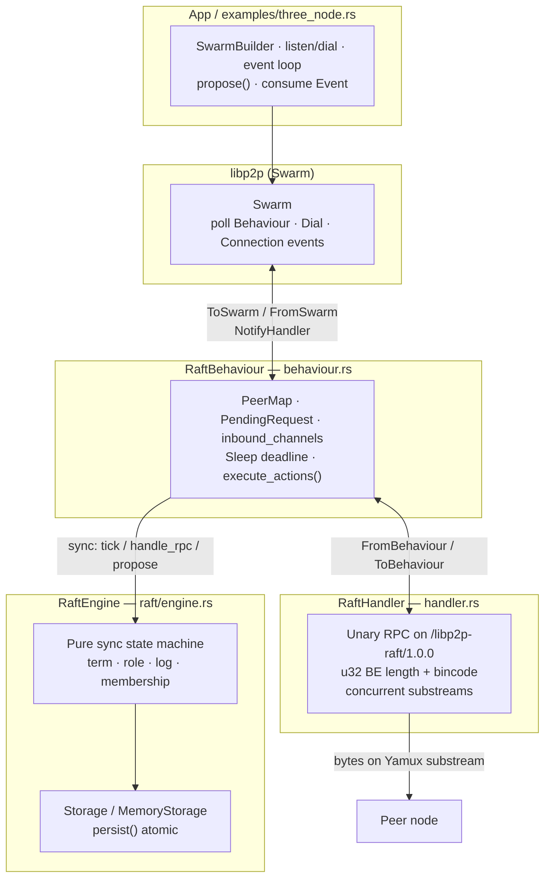
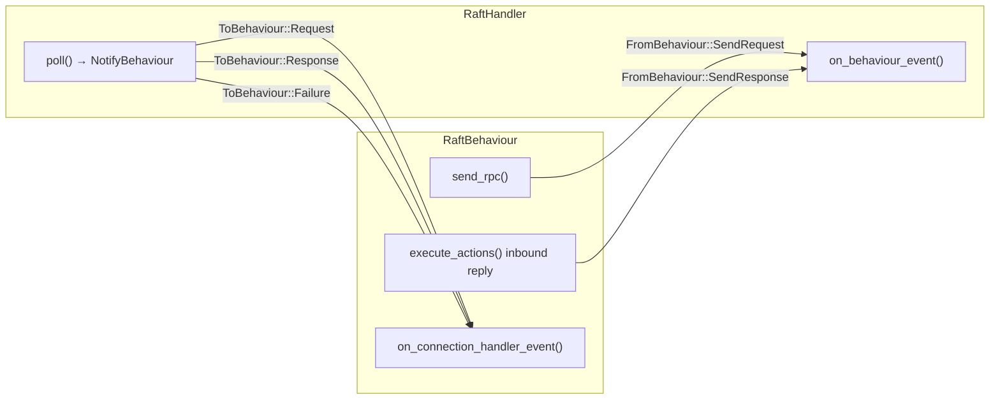
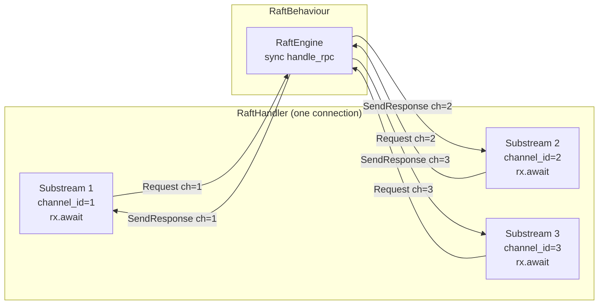
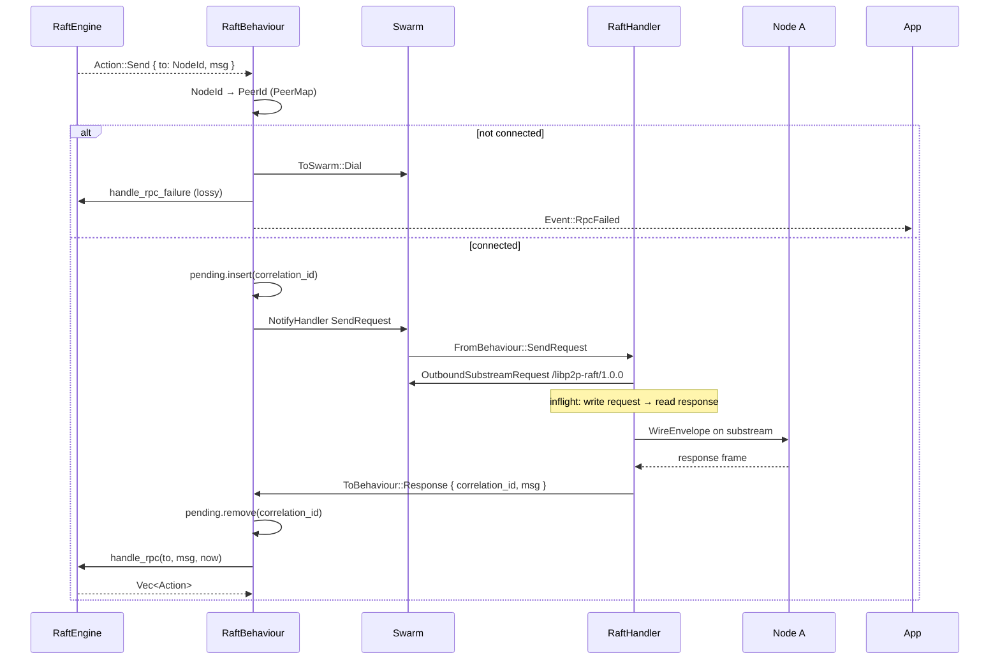
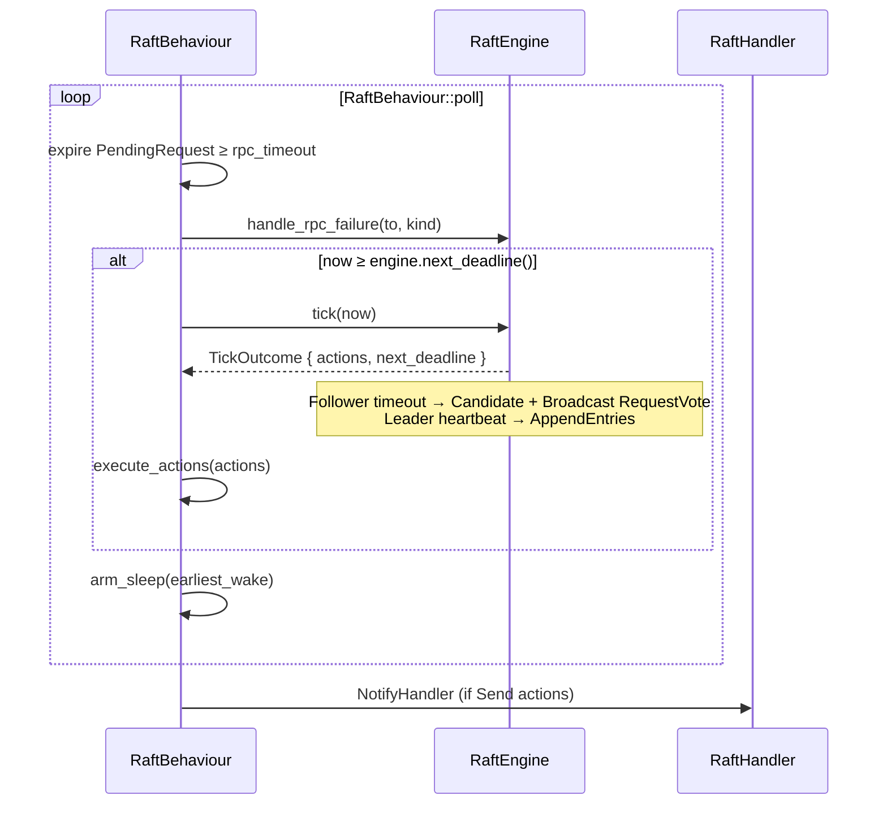
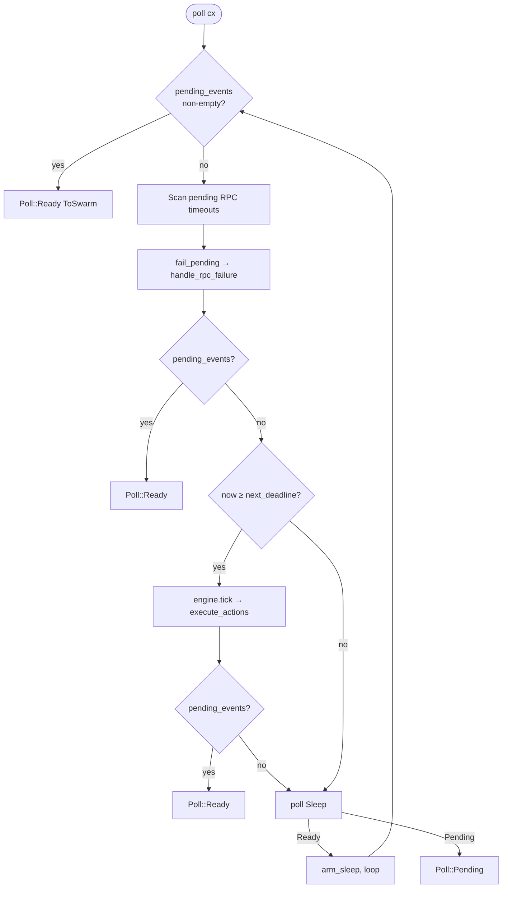
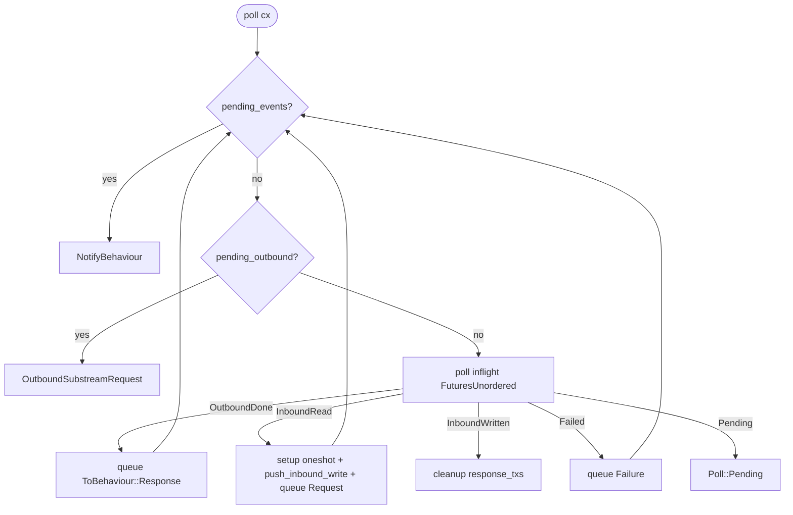
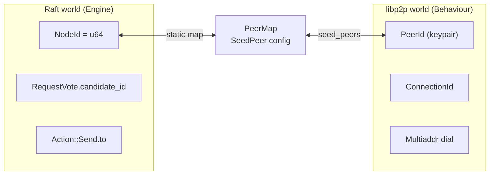
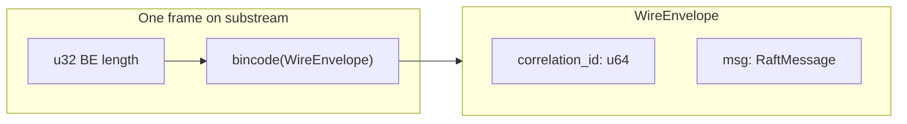

# Handler → Behaviour → Engine Architecture

Detailed documentation for the three main layers of the `libp2p-raft` crate: how `ConnectionHandler` handles I/O, `RaftBehaviour` adapts libp2p, and `RaftEngine` runs the pure Raft state machine.

**Source code:** `src/handler.rs`, `src/behaviour.rs`, `src/raft/engine.rs`, `src/protocol/messages.rs`

**Related:** [libp2p fundamentals](libp2p-fundamentals.md) (connection → substream → protocol), [design spec](superpowers/specs/2026-07-23-libp2p-raft-design.md), [Vietnamese version](handler-behaviour-engine.md)

---

## 1. Big picture

This crate separates **consensus logic** from **networking**. The Engine never sees `PeerId`, dial, or streams. Behaviour is the only bridge between the Raft world (`NodeId`) and the libp2p world (`PeerId`, `ConnectionId`, substream).



### Threading model

- **One** Swarm event loop.
- `RaftEngine` is called **synchronously** from `RaftBehaviour::poll`, `on_connection_handler_event`, or `propose` — no background consensus thread.
- Handler runs async I/O via `FuturesUnordered` but still lives inside the same Swarm poll task.

---

## 2. Layer responsibilities

| Layer | File | Owns | Does NOT own |
|-------|------|------|--------------|
| **RaftHandler** | `handler.rs` | Substream open/read/write/close; encode/decode `WireEnvelope`; concurrent RPCs; `channel_id` for inbound response routing | term, vote, commit_index; PeerMap; RPC timeouts |
| **RaftBehaviour** | `behaviour.rs` | `RaftEngine` + Storage; `PeerMap`; `PendingRequest` + `correlation_id`; `inbound_channels`; Sleep; Action → Dial/NotifyHandler/Event | Raft algorithm details; raw bytes |
| **RaftEngine** | `raft/engine.rs` | role, term, leader, votes; log via `Storage::persist`; next_index/match_index; election/heartbeat deadlines; membership; `Vec<Action>` | PeerId, Multiaddr, Dial; correlation_id; streams |

### Boundary rule

```text
Engine    → NodeId, RaftMessage, Instant only
Behaviour → translates NodeId ↔ PeerId, assigns correlation_id, manages RPC lifecycle
Handler   → moves WireEnvelope bytes on substreams only
```

The Engine **never** dials or opens streams. Every `Action::Send` is translated by Behaviour into `NotifyHandler` or `ToSwarm::Dial`.

---

## 3. Core data structures

### 3.1 RaftHandler (`handler.rs`)

```rust
pub enum FromBehaviour {
    SendRequest { correlation_id, msg },
    SendResponse { channel_id, correlation_id, msg },
}

pub enum ToBehaviour {
    Request { correlation_id, msg, channel_id },
    Response { correlation_id, msg },
    Failure { correlation_id: Option<u64>, error },
}
```

**Internal Handler state:**

| Field | Role |
|-------|------|
| `pending_outbound` | Queue of outbound RPCs waiting to open a substream |
| `inflight` | `FuturesUnordered` — async read/write frame tasks |
| `response_txs` | `channel_id → oneshot::Sender` — waits for Behaviour to send inbound response |
| `pending_events` | Events ready to notify Behaviour |

### 3.2 RaftBehaviour (`behaviour.rs`)

```rust
struct PendingRequest {
    correlation_id: u64,
    to: NodeId,
    peer: PeerId,
    kind: RpcKind,
    sent_at: Instant,
    msg: RaftMessage,
}

struct InboundChannel {
    peer: PeerId,
    conn: ConnectionId,
    correlation_id: u64,
}
```

**Internal Behaviour state:**

| Field | Role |
|-------|------|
| `engine` | Pure Raft state machine |
| `peer_map` | `NodeId ↔ PeerId` + seed addresses |
| `connected` | `PeerId → Set<ConnectionId>` |
| `pending` | `correlation_id → PendingRequest` (outbound awaiting response) |
| `inbound_channels` | `channel_id → InboundChannel` (inbound request being processed) |
| `sleep` | Deadline timer — min(engine deadline, RPC timeout) |
| `pending_events` | Queue of `ToSwarm` (Dial, NotifyHandler, GenerateEvent) |

### 3.3 RaftEngine (`raft/engine.rs`)

```rust
pub enum Action {
    Send { to: NodeId, msg: RaftMessage },
    Broadcast { msg: RaftMessage },
    Apply { entries: Vec<LogEntry> },
    BecomeLeader { term },
    BecomeFollower { term, leader },
    BecomeCandidate { term },
    SnapshotInstallComplete { index },
}
```

---

## 4. Event contracts

### 4.1 Behaviour ↔ Handler



| Direction | Event | Meaning |
|-----------|-------|---------|
| BH → H | `SendRequest { correlation_id, msg }` | Open outbound substream; write envelope; read one response |
| BH → H | `SendResponse { channel_id, correlation_id, msg }` | Answer inbound request on the same substream |
| H → BH | `Request { correlation_id, msg, channel_id }` | Inbound RPC; Behaviour maps PeerId → NodeId then calls engine |
| H → BH | `Response { correlation_id, msg }` | Outbound complete; match `PendingRequest` |
| H → BH | `Failure { correlation_id?, error }` | Upgrade/IO error — does **not** remove node from membership |

### 4.2 Engine → Behaviour (Actions)

| Action | Behaviour translation |
|--------|----------------------|
| `Send { to, msg }` | PeerMap → PeerId → (Dial if not connected) → `NotifyHandler SendRequest`; or `SendResponse` when answering inbound |
| `Broadcast { msg }` | Expand to `Send` for every other voter |
| `BecomeLeader/Follower/Candidate` | `ToSwarm::GenerateEvent(Event::RoleChanged)` |
| `Apply { entries }` | `Event::Committed { entries }` |
| `SnapshotInstallComplete` | Phase 4 stub (currently no-op) |

---

## 5. Detailed flows

### 5.1 Inbound RPC (A sends request to B)

This is the most subtle flow. **Behaviour never writes to `inflight`.** Only the Handler manages `inflight`. The Handler uses a **oneshot channel** to bridge “Raft processing in Behaviour/Engine” and “write response bytes on the same substream”.

#### Overview

When node A opens an inbound substream to B:

1. Handler spawns **inflight task #1** to read the request frame.
2. After read completes, Handler allocates `channel_id`, creates `(tx, rx)` oneshot, spawns **inflight task #2** blocked on `rx.await`, and notifies Behaviour with `ToBehaviour::Request`.
3. Behaviour calls Engine synchronously; Engine returns `Action::Send { to: from, msg }`.
4. Behaviour sends `FromBehaviour::SendResponse { channel_id, ... }` to Handler.
5. Handler calls `tx.send(...)` → unblocks task #2 → writes response frame → A receives it.

```mermaid
sequenceDiagram
  participant A as Node A
  participant H as RaftHandler (B)
  participant BH as RaftBehaviour (B)
  participant E as RaftEngine (B)
  participant ST as Storage

  A->>H: FullyNegotiatedInbound (substream)
  Note over H: inflight #1: read_frame()

  H->>H: read complete → alloc channel_id
  H->>H: oneshot (tx, rx); response_txs[channel_id] = tx
  H->>H: inflight #2: push_inbound_write(rx) — blocked on rx.await
  H->>BH: ToBehaviour::Request { channel_id, correlation_id, msg }

  BH->>BH: PeerId → NodeId (PeerMap)
  BH->>BH: inbound_channels.insert(channel_id)
  BH->>E: handle_rpc(from, msg, now)
  E->>ST: persist() if needed
  E-->>BH: Vec<Action> (typically Send response back to from)

  BH->>BH: execute_actions(..., Some((from, channel_id)))
  BH->>H: FromBehaviour::SendResponse { channel_id, correlation_id, msg }

  H->>H: response_txs.remove(channel_id).send(resp)
  Note over H: inflight #2: rx.await unblocks → write_frame(response)
  H->>A: response bytes on same substream
```

#### Step-by-step (Handler side)

**Step 1 — Substream arrives**

```rust
ConnectionEvent::FullyNegotiatedInbound { protocol: stream, .. } => {
    self.push_inbound_read(stream);
}
```

`push_inbound_read`:
- Allocates `channel_id` immediately (before read finishes).
- Pushes **task #1** into `inflight`: async `read_frame(stream)`.

**Step 2 — Read completes (`InboundRead`)**

When task #1 finishes, Handler does three things in one poll iteration:

```rust
let (tx, rx) = oneshot::channel();
self.response_txs.insert(channel_id, tx);
self.push_inbound_write(stream, channel_id, correlation_id, rx);  // task #2
self.pending_events.push_back(ToBehaviour::Request { correlation_id, msg, channel_id });
```

| What | Why |
|------|-----|
| `response_txs[channel_id] = tx` | Store sender so Behaviour can wake the write task later |
| `push_inbound_write(..., rx)` | **Task #2** in `inflight`: holds the substream open, blocks on `rx.await` |
| `ToBehaviour::Request` | Tell Behaviour to run Raft logic |

Task #2 code (simplified):

```rust
async move {
    let (corr, resp_msg) = rx.await?;           // wait for Behaviour
    write_frame(&mut stream, &WireEnvelope { correlation_id: corr, msg: resp_msg }).await?;
    // stream closes after unary RPC
}
```

**Step 3 — Behaviour responds**

```rust
// on_connection_handler_event
self.inbound_channels.insert(channel_id, InboundChannel { peer, conn, correlation_id });
let actions = self.engine.handle_rpc(from, msg, now);
self.execute_actions(actions, Some((from, channel_id)));
```

If Engine returns `Action::Send { to: from, msg }`, Behaviour routes it as an inbound reply:

```rust
// execute_actions — when to == inbound_from
ToSwarm::NotifyHandler {
    event: FromBehaviour::SendResponse { channel_id, correlation_id, msg },
}
```

**Step 4 — Handler unblocks write**

```rust
// on_behaviour_event
if let Some(tx) = self.response_txs.remove(&channel_id) {
    let _ = tx.send((correlation_id, msg));  // unblocks rx.await in task #2
}
```

Task #2 writes the response frame. Node A receives it on the **same substream** that carried the request.

#### `channel_id` vs `correlation_id`

| ID | Scope | Purpose |
|----|-------|---------|
| `correlation_id` | Wire protocol (both peers) | Matches request/response on the network; assigned by **sender's Behaviour** for outbound; echoed by receiver for inbound reply |
| `channel_id` | Local Handler only | Routes inbound response to the correct substream + oneshot; assigned by **receiver's Handler** |

They solve different problems:
- `correlation_id` — “which RPC is this on the wire?”
- `channel_id` — “which open inbound substream should I write the answer on?”

#### Concurrent inbound RPCs

Multiple substreams can be open on one connection. Each gets its own `channel_id`, oneshot pair, and inflight write task. Behaviour processes each `Request` synchronously when Handler notifies it; Handler keeps all substreams alive via separate `rx.await` waiters.



---

### 5.2 Outbound RPC (B sends request to A)

Engine emits `Action::Send` → Behaviour assigns `correlation_id` → Handler opens outbound substream.



**Key points:**

- `correlation_id` is assigned by **Behaviour** — Engine never sees it.
- Outbound RPC is **lossy** when not connected: Behaviour dials, calls `handle_rpc_failure`, drops the current RPC; heartbeat/election tick retries later.
- `PendingRequest.sent_at` drives RPC timeout in `Behaviour::poll`.

**Outbound inflight (single task per RPC):**

Unlike inbound (read task + write-wait task), outbound uses one inflight task:

```rust
// push_outbound_io
write_frame(stream, request).await?;
read_frame(stream).await?;  // → ToBehaviour::Response
```

---

### 5.3 Deadline timer (`tick`)



| Role | Timer fires | Engine output |
|------|-------------|---------------|
| Follower | election timeout | `BecomeCandidate` + `Broadcast RequestVote` |
| Candidate | election timeout (retry) | new term + `Broadcast RequestVote` |
| Leader | heartbeat interval | `Send AppendEntries` (empty entries = heartbeat) |

RPC timeout does **not** retry the same frame directly — it calls `handle_rpc_failure` to clear `ae_inflight`; tick/heartbeat retries later.

---

### 5.4 `propose(data)` → commit

```mermaid
sequenceDiagram
  participant App
  participant BH as RaftBehaviour
  participant E as RaftEngine
  participant ST as Storage
  participant F as Follower handlers

  App->>BH: propose(data)
  BH->>E: propose(data)
  E->>ST: persist(None, [LogEntry])
  E-->>BH: (index, replicate Actions)
  BH->>F: AppendEntries per follower (ae_inflight depth 1)

  F-->>BH: AppendEntriesResp { success, match_index }
  BH->>E: handle_rpc(follower, resp)
  E->>E: advance match_index; check majority
  E-->>BH: Action::Apply { entries }
  BH-->>App: Event::Committed { entries }
```

**Leader replication:**

- `next_index[peer]` / `match_index[peer]` track per-follower progress.
- Reject → simple `next_index` decrement (no conflict-index optimization).
- Commit when majority has `match_index >= N` and entry term == current term.
- `ae_inflight`: pipeline depth 1 — no second AppendEntries to a peer until its response arrives.

---

## 6. `poll()` execution order

### 6.1 RaftBehaviour::poll



| Step | Description |
|------|-------------|
| 1 | Drain `pending_events` → return `ToSwarm` (Dial / NotifyHandler / GenerateEvent) |
| 2 | Expire `PendingRequest` ≥ `rpc_timeout` → `handle_rpc_failure` |
| 3 | If `now ≥ engine.next_deadline()` → `engine.tick(now)` |
| 4 | Poll `Sleep`; Ready → re-arm and loop; Pending → return |

`earliest_wake = min(engine.next_deadline(), min(pending.sent_at + rpc_timeout))`.

### 6.2 RaftHandler::poll



---

## 7. Identity: NodeId vs PeerId



| Concept | Layer | Notes |
|---------|-------|-------|
| `NodeId` | Engine, membership | Stable voting identity in the cluster |
| `PeerId` | libp2p connection | From keypair — must be pinned, never regenerated |
| `PeerMap` | Behaviour | Static map from `SeedPeer { node_id, peer_id, addrs }` |
| Connection drop | Behaviour | `fail_peer_pending` — does **not** remove from membership |

---

## 8. Wire format



| Property | Value |
|----------|-------|
| Protocol ID | `/libp2p-raft/1.0.0` |
| Framing | `u32` big-endian length + bincode payload |
| RPC model | Unary — 1 substream = 1 request + 1 response, then close |
| Max frame | 4 MiB (`MAX_FRAME_BYTES`) |
| Concurrency | Many substreams in parallel on one connection |

---

## 9. Error handling & edge cases

| Situation | Behavior |
|-----------|----------|
| Not connected on `Send` | Dial + `handle_rpc_failure` + `RpcFailed` (lossy) |
| RPC timeout | `fail_pending` → `handle_rpc_failure`; tick retries later |
| Connection closed | `fail_peer_pending` for all pending RPCs to that peer |
| Dial failure | `fail_peer_pending` + `RpcFailed` |
| Unknown PeerId | `RpcFailed` — engine not called |
| Stale term in response | Engine ignores (validates term on every inbound) |
| Inbound with no response action | Behaviour drops `inbound_channels`; write task may fail on dropped oneshot |
| `ae_inflight` | Leader does not pipeline AE — depth 1 per follower |

**Important:** Connection drop ≠ Raft membership remove. Membership only changes via log entry `EntryType::Config`.

---

## 10. End-to-end diagram (all directions)

```mermaid
flowchart TB
  subgraph Inbound["Inbound (peer → us)"]
    I1["Handler: read frame"]
    I2["Handler: oneshot + rx.await write waiter"]
    I3["Behaviour: handle_rpc"]
    I4["Engine: Action::Send reply"]
    I5["Handler: tx.send → write response"]
    I1 --> I2 --> I3 --> I4 --> I5
  end

  subgraph Outbound["Outbound (us → peer)"]
    O1["Engine: Action::Send"]
    O2["Behaviour: correlation_id + PendingRequest"]
    O3["Handler: write + read"]
    O4["Behaviour: handle_rpc response"]
    O1 --> O2 --> O3 --> O4
  end

  subgraph Timer["Timer (local)"]
    T1["Behaviour: tick due"]
    T2["Engine: election / heartbeat"]
    T3["Behaviour: Broadcast/Send"]
    T1 --> T2 --> T3
  end

  ENG["RaftEngine"] --> Inbound
  ENG --> Outbound
  ENG --> Timer
```



---

## 11. Quick reference

1. **Handler** = I/O worker per connection; no Raft semantics.
2. **Behaviour** = adapter; owns networking state + calls Engine synchronously.
3. **Engine** = pure Raft SM; outputs `Action`, consumes RPC + time.
4. **correlation_id** = wire-level request/response matching (Behaviour assigns for outbound).
5. **channel_id** = Handler-local routing for inbound response on the correct substream.
6. **inflight** = Handler-only async task pool; Behaviour never touches it.
7. **oneshot (tx/rx)** = bridge between sync Raft processing and async substream write.
8. **NodeId** = Raft; **PeerId** = libp2p; **PeerMap** = bridge.
9. **Single poll loop** — no background consensus task.
