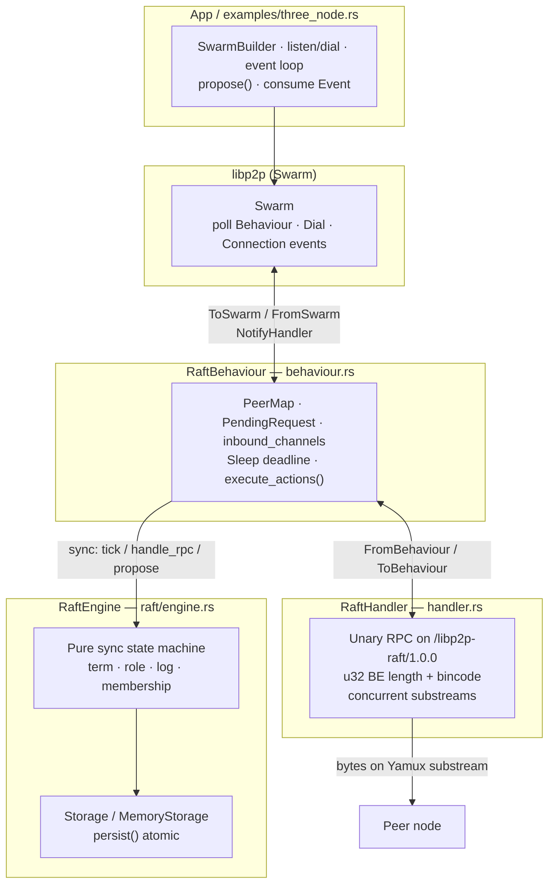
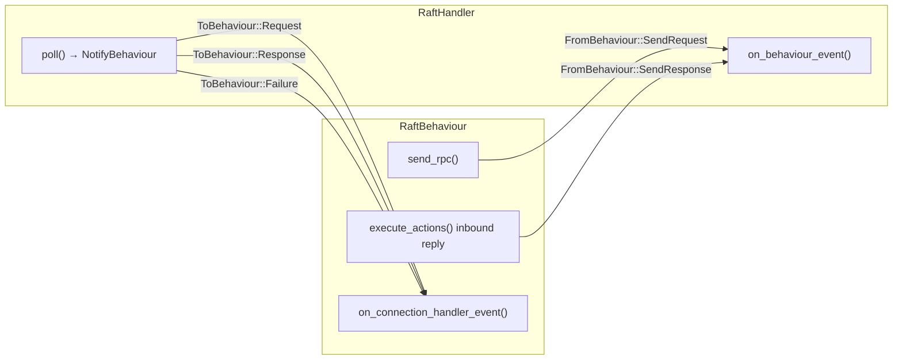
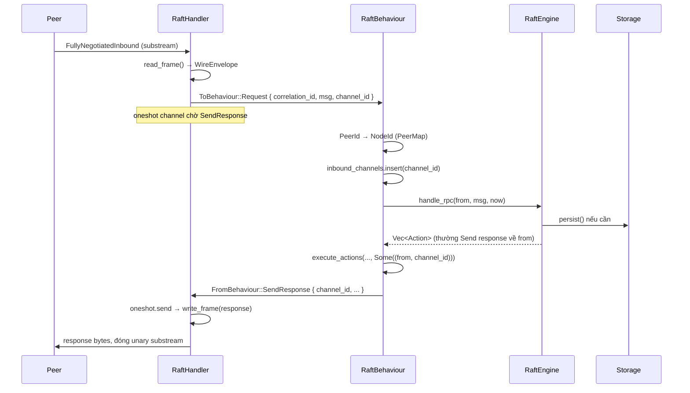
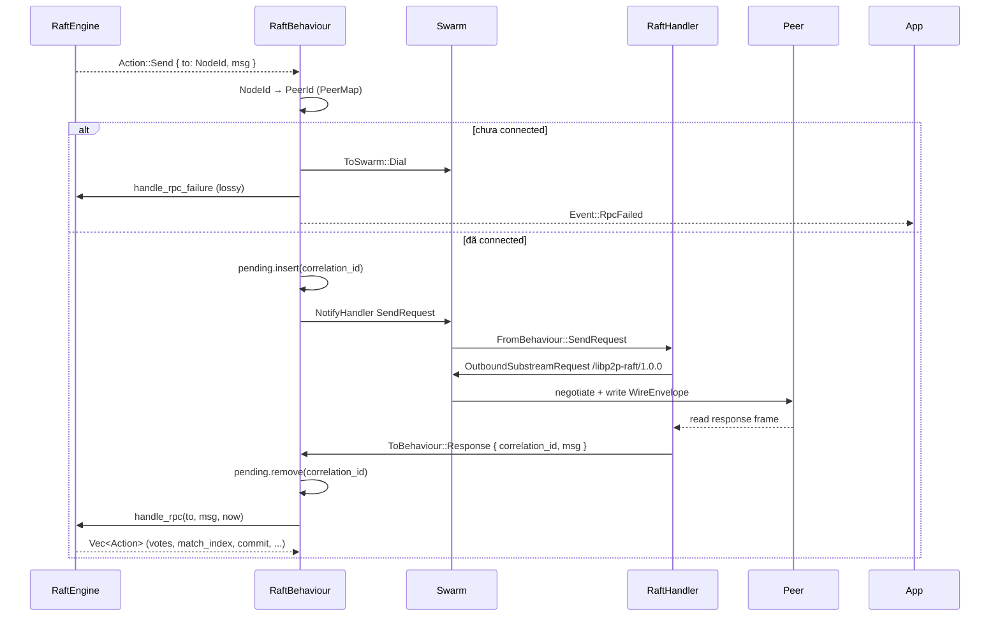
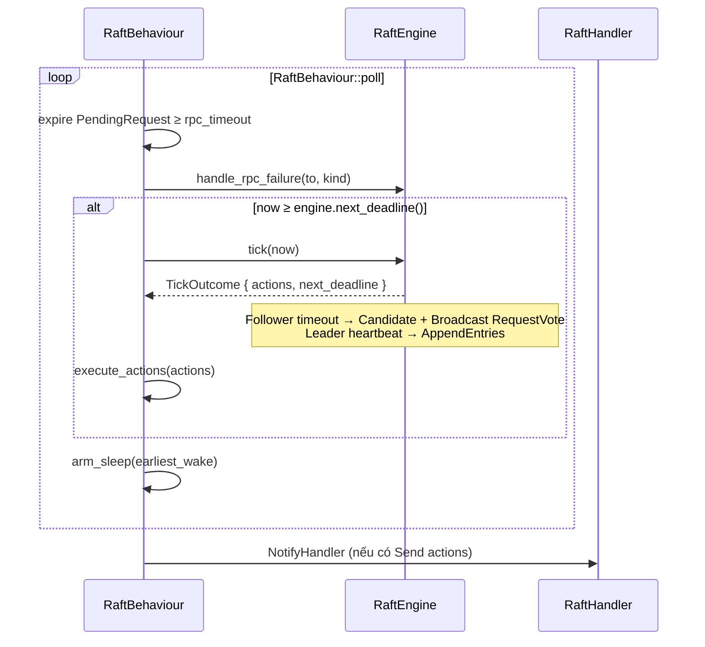
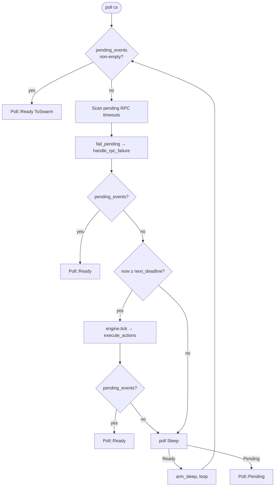
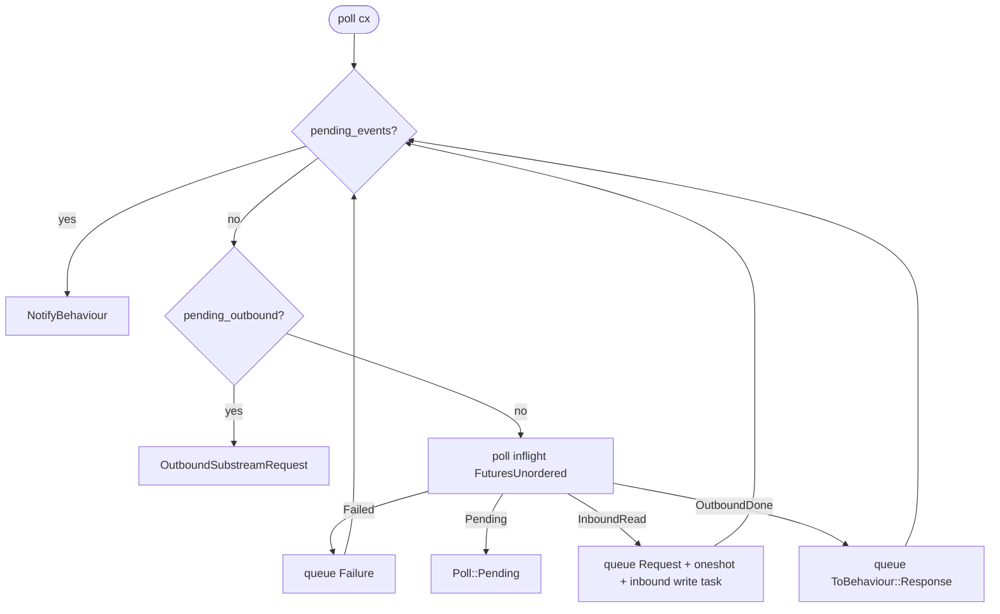
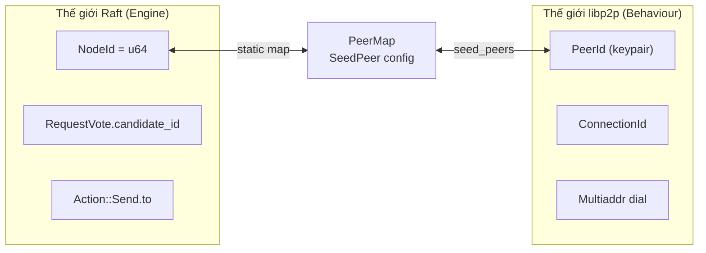
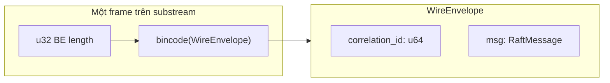
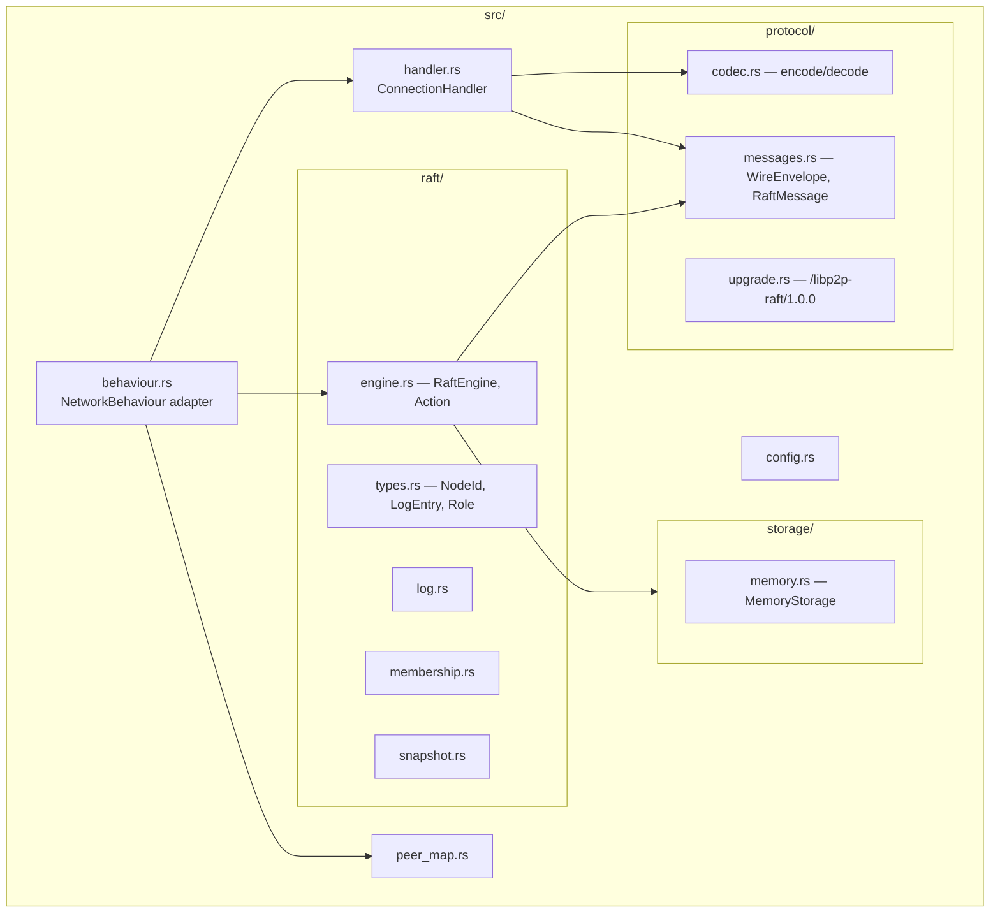

# Kiến trúc Handler → Behaviour → Engine

Tài liệu chi tiết về ba tầng chính của crate `libp2p-raft`: cách `ConnectionHandler` xử lý I/O, `RaftBehaviour` làm adapter libp2p, và `RaftEngine` chạy state machine Raft thuần.

**Nguồn mã:** `src/handler.rs`, `src/behaviour.rs`, `src/raft/engine.rs`, `src/protocol/messages.rs`

**Liên quan:** [libp2p fundamentals](libp2p-fundamentals.md) (connection → substream → protocol), [design spec](superpowers/specs/2026-07-23-libp2p-raft-design.md)

---

## 1. Bức tranh tổng thể

Crate này tách **consensus logic** khỏi **networking**. Engine không biết `PeerId`, dial, hay stream. Behaviour là cầu nối duy nhất giữa thế giới Raft (`NodeId`) và thế giới libp2p (`PeerId`, `ConnectionId`, substream).



### Mô hình luồng (threading)

- **Một** Swarm event loop duy nhất.
- `RaftEngine` được gọi **đồng bộ** từ `RaftBehaviour::poll`, `on_connection_handler_event`, hoặc `propose` — không có background consensus thread.
- Handler chạy async I/O qua `FuturesUnordered` nhưng vẫn nằm trong cùng task poll của Swarm.

---

## 2. Trách nhiệm từng tầng

| Tầng | File | Sở hữu | Không sở hữu |
|------|------|--------|--------------|
| **RaftHandler** | `handler.rs` | Mở/đọc/ghi/đóng substream; encode/decode `WireEnvelope`; nhiều RPC đồng thời; `channel_id` cho inbound response | term, vote, commit_index; PeerMap; timeout RPC |
| **RaftBehaviour** | `behaviour.rs` | `RaftEngine` + Storage; `PeerMap`; `PendingRequest` + `correlation_id`; `inbound_channels`; Sleep; Action → Dial/NotifyHandler/Event | Chi tiết thuật toán Raft; raw bytes |
| **RaftEngine** | `raft/engine.rs` | role, term, leader, votes; log qua `Storage::persist`; next_index/match_index; election/heartbeat deadline; membership; `Vec<Action>` | PeerId, Multiaddr, Dial; correlation_id; stream |

### Quy tắc ranh giới (boundary rule)

```text
Engine  → chỉ NodeId, RaftMessage, Instant
Behaviour → dịch NodeId ↔ PeerId, gán correlation_id, quản lý RPC lifecycle
Handler → chỉ di chuyển WireEnvelope trên substream
```

Engine **không bao giờ** gọi dial hay mở stream. Mọi `Action::Send` đều do Behaviour chuyển thành `NotifyHandler` hoặc `ToSwarm::Dial`.

---

## 3. Cấu trúc dữ liệu chính

### 3.1 RaftHandler (`handler.rs`)

```rust
pub enum FromBehaviour {
    SendRequest { correlation_id, msg },
    SendResponse { channel_id, correlation_id, msg },
}

pub enum ToBehaviour {
    Request { correlation_id, msg, channel_id },
    Response { correlation_id, msg },
    Failure { correlation_id: Option<u64>, error },
}
```

**State nội bộ Handler:**

| Field | Vai trò |
|-------|---------|
| `pending_outbound` | Hàng đợi RPC outbound chờ mở substream |
| `inflight` | `FuturesUnordered` — read/write frame async |
| `response_txs` | `channel_id → oneshot::Sender` — chờ Behaviour gửi response inbound |
| `pending_events` | Sự kiện sẵn sàng báo lên Behaviour |

### 3.2 RaftBehaviour (`behaviour.rs`)

```rust
struct PendingRequest {
    correlation_id: u64,
    to: NodeId,
    peer: PeerId,
    kind: RpcKind,
    sent_at: Instant,
    msg: RaftMessage,
}

struct InboundChannel {
    peer: PeerId,
    conn: ConnectionId,
    correlation_id: u64,
}
```

**State nội bộ Behaviour:**

| Field | Vai trò |
|-------|---------|
| `engine` | Pure Raft state machine |
| `peer_map` | `NodeId ↔ PeerId` + seed addresses |
| `connected` | `PeerId → Set<ConnectionId>` |
| `pending` | `correlation_id → PendingRequest` (outbound đang chờ response) |
| `inbound_channels` | `channel_id → InboundChannel` (đang xử lý request inbound) |
| `sleep` | Deadline timer — min(engine deadline, RPC timeout) |
| `pending_events` | Hàng đợi `ToSwarm` (Dial, NotifyHandler, GenerateEvent) |

### 3.3 RaftEngine (`raft/engine.rs`)

```rust
pub enum Action {
    Send { to: NodeId, msg: RaftMessage },
    Broadcast { msg: RaftMessage },
    Apply { entries: Vec<LogEntry> },
    BecomeLeader { term },
    BecomeFollower { term, leader },
    BecomeCandidate { term },
    SnapshotInstallComplete { index },
}
```

**State nội bộ Engine:**

| Field | Vai trò |
|-------|---------|
| `storage` | Hard state + log + snapshot (trait `Storage`) |
| `role`, `leader`, `votes` | Election state |
| `next_index`, `match_index` | Leader replication tracking |
| `ae_inflight` | Pipeline depth 1 — không gửi AE tiếp cho peer cho đến khi có response |
| `election_deadline`, `heartbeat_deadline` | Absolute deadlines cho `tick()` |
| `commit_index`, `last_applied` | Commit / apply progress |

---

## 4. Hợp đồng sự kiện (event contracts)

### 4.1 Behaviour ↔ Handler



| Hướng | Event | Ý nghĩa |
|-------|-------|---------|
| BH → H | `SendRequest { correlation_id, msg }` | Mở outbound substream; ghi envelope; đọc một response |
| BH → H | `SendResponse { channel_id, correlation_id, msg }` | Trả lời request inbound trên cùng substream |
| H → BH | `Request { correlation_id, msg, channel_id }` | RPC inbound; Behaviour map PeerId → NodeId rồi gọi engine |
| H → BH | `Response { correlation_id, msg }` | Outbound hoàn tất; match `PendingRequest` |
| H → BH | `Failure { correlation_id?, error }` | Lỗi upgrade/IO — **không** xóa node khỏi membership |

### 4.2 Engine → Behaviour (Actions)

| Action | Behaviour dịch thành |
|--------|----------------------|
| `Send { to, msg }` | `PeerMap` → PeerId → (Dial nếu chưa connected) → `NotifyHandler SendRequest`; hoặc `SendResponse` nếu trả lời inbound |
| `Broadcast { msg }` | Mở rộng thành `Send` cho mỗi voter khác |
| `BecomeLeader/Follower/Candidate` | `ToSwarm::GenerateEvent(Event::RoleChanged)` |
| `Apply { entries }` | `Event::Committed { entries }` |
| `SnapshotInstallComplete` | Stub Phase 4 (hiện no-op) |

### 4.3 Behaviour → App (public events)

| Event | Khi nào |
|-------|---------|
| `RoleChanged { role, term, leader }` | Engine chuyển role (election xong) |
| `Committed { entries }` | Majority replicate → commit_index tăng |
| `PeerMapped { peer, node }` | Startup từ seed_peers |
| `RpcFailed { peer, error }` | Timeout, dial fail, connection closed, unknown peer |

---

## 5. Luồng chi tiết

### 5.1 Inbound RPC (peer gửi tới ta)

Peer mở substream inbound → Handler đọc frame → Engine xử lý → Handler ghi response.



**Điểm quan trọng:**

- `channel_id` do Handler cấp phát — dùng để ghép response đúng substream inbound.
- Nếu Engine không trả `Send { to: from }`, Behaviour xóa `inbound_channels` để tránh leak.
- Handler giữ substream mở qua oneshot cho đến khi Behaviour gửi `SendResponse`.

### 5.2 Outbound RPC (ta gửi tới peer)

Engine emit `Action::Send` → Behaviour gán `correlation_id` → Handler mở substream outbound.



**Điểm quan trọng:**

- `correlation_id` do Behaviour cấp — Engine không biết.
- RPC outbound **lossy** khi chưa connected: Behaviour dial rồi drop RPC hiện tại; heartbeat/election tick sẽ retry sau.
- `PendingRequest` lưu `sent_at` để timeout.

### 5.3 Deadline timer (`tick`)



**Follower:** election timeout → `BecomeCandidate` + `Broadcast RequestVote`.

**Leader:** heartbeat interval → gửi `AppendEntries` (entries rỗng = heartbeat).

**Timeout RPC:** không retry trực tiếp — gọi `handle_rpc_failure` để clear `ae_inflight`; tick/heartbeat retry sau.

### 5.4 `propose(data)` → commit

```mermaid
sequenceDiagram
  participant App
  participant Behaviour as RaftBehaviour
  participant Engine as RaftEngine
  participant Storage
  participant Followers as Follower handlers

  App->>Behaviour: propose(data)
  Behaviour->>Engine: propose(data)
  Engine->>Storage: persist(None, [LogEntry])
  Engine-->>Behaviour: (index, replicate Actions)
  Behaviour->>Followers: AppendEntries (per follower, ae_inflight=1)

  Followers-->>Behaviour: AppendEntriesResp { success, match_index }
  Behaviour->>Engine: handle_rpc(follower, resp)
  Engine->>Engine: advance match_index; check majority
  Engine-->>Behaviour: Action::Apply { entries }
  Behaviour-->>App: Event::Committed { entries }
```

**Leader replication:**

- `next_index[peer]` / `match_index[peer]` theo dõi tiến độ từng follower.
- Reject → simple `next_index` decrement (không conflict-index hint).
- Commit khi majority có `match_index >= N` và entry term == current term.

---

## 6. Vòng `poll()` — thứ tự thực thi

### 6.1 RaftBehaviour::poll



| Bước | Mô tả |
|------|-------|
| 1 | Drain `pending_events` → trả `ToSwarm` (Dial / NotifyHandler / GenerateEvent) |
| 2 | Hết hạn `PendingRequest` ≥ `rpc_timeout` → `handle_rpc_failure` |
| 3 | Nếu `now ≥ engine.next_deadline()` → `engine.tick(now)` |
| 4 | Poll `Sleep`; Ready → re-arm và loop; Pending → return |

`earliest_wake = min(engine.next_deadline(), min(pending.sent_at + rpc_timeout))`.

### 6.2 RaftHandler::poll



---

## 7. Identity: NodeId vs PeerId



| Khái niệm | Layer | Ghi chú |
|----------|-------|---------|
| `NodeId` | Engine, membership | Voting identity ổn định trong cluster |
| `PeerId` | libp2p connection | Từ keypair — phải pin, không regenerate |
| `PeerMap` | Behaviour | Map tĩnh từ `SeedPeer { node_id, peer_id, addrs }` |
| Connection drop | Behaviour | `fail_peer_pending` — **không** remove khỏi membership |

---

## 8. Wire format



```rust
pub struct WireEnvelope {
    pub correlation_id: u64,
    pub msg: RaftMessage,
}

// RaftMessage variants:
// RequestVote / RequestVoteResp
// AppendEntries / AppendEntriesResp
// InstallSnapshot / InstallSnapshotResp
// Heartbeat = AppendEntries { entries: [] }
```

| Thuộc tính | Giá trị |
|------------|---------|
| Protocol ID | `/libp2p-raft/1.0.0` |
| Framing | `u32` big-endian length + bincode payload |
| RPC model | Unary — 1 substream = 1 request + 1 response, rồi đóng |
| Max frame | 4 MiB (`MAX_FRAME_BYTES`) |
| Concurrent | Nhiều substream song song trên cùng connection |

---

## 9. Xử lý lỗi & edge cases

| Tình huống | Hành vi |
|------------|---------|
| Chưa connected khi `Send` | Dial + `handle_rpc_failure` + `RpcFailed` (lossy) |
| RPC timeout | `fail_pending` → `handle_rpc_failure`; tick retry sau |
| Connection closed | `fail_peer_pending` cho mọi pending tới peer đó |
| Dial failure | `fail_peer_pending` + `RpcFailed` |
| Unknown PeerId | `RpcFailed` — không gọi engine |
| Stale term trong response | Engine ignore (validate term mỗi inbound) |
| Inbound không có response action | Behaviour drop `inbound_channels` |
| `ae_inflight` | Leader không pipeline AE — depth 1 per follower |

**Lưu ý:** Connection drop ≠ Raft membership remove. Membership chỉ đổi qua log entry `EntryType::Config`.

---

## 10. Sơ đồ module trong crate



---

## 11. Tóm tắt nhanh

1. **Handler** = I/O worker per connection; không hiểu Raft.
2. **Behaviour** = adapter; owns networking state + gọi Engine sync.
3. **Engine** = pure Raft SM; output `Action`, input RPC + time.
4. **correlation_id** = Behaviour/Handler — match outbound request/response.
5. **channel_id** = Handler — route inbound response về đúng substream.
6. **NodeId** = Raft; **PeerId** = libp2p; **PeerMap** = cầu nối.
7. **Single poll loop** — không background consensus task.
