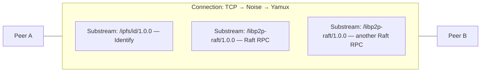

# libp2p fundamentals (for this crate)

How two peers go from “I know your address” to “we exchange Raft frames” — from the ground up.

This is the networking layer underneath `RaftEngine`. Consensus logic never dials or opens streams; it only emits `Action`s. Everything below is what `Swarm` + `RaftBehaviour` + `ConnectionHandler` do.

---

## 1. Mental model: three layers

Do not mix these up:


| Layer                    | What it is                                         | Analogy                                              |
| ------------------------ | -------------------------------------------------- | ---------------------------------------------------- |
| **Connection**           | One secure, multiplexed link between two `PeerId`s | A phone call is connected                            |
| **Substream**            | One logical channel *on* that connection           | One topic of conversation on the same call           |
| **Application protocol** | Agreed rules for bytes on a substream (e.g. Raft)  | Both sides speaking the same language for that topic |





One connection can carry **many** substreams. Rejecting a Raft substream does **not** tear down the whole connection.

---

## 2. Step A — establish a connection

Before any Raft message exists:

1. App builds a `Swarm` with transport: **TCP + Noise + Yamux** (in `examples/`, not inside this library).
2. Node A `dial`s Node B’s `Multiaddr` (from `seed_peers`), or B accepts an inbound dial.
3. libp2p runs **connection upgrades** (not Raft yet):
  - raw TCP socket
  - **Noise** — encrypt + authenticate → each side learns the other’s `PeerId`
  - **Yamux** — multiplex many substreams over one socket

After this, Swarm owns a **connection**. Still no Raft framing.

**Important:** connection up/down is *not* Raft membership. A dropped TCP link is a transport failure; removing a voter is a separate membership log entry.

---

## 3. Step B — open a substream and negotiate a protocol

When `RaftBehaviour` wants to send an RPC (because the engine returned `Action::Send`):

1. Behaviour tells the **per-connection** `ConnectionHandler`: “open outbound, send this envelope.”
2. Handler asks Yamux for a **new substream**.
3. On that substream, libp2p runs **multistream-select** (protocol negotiation):
  - A proposes: `/libp2p-raft/1.0.0`
  - B accepts only if it **advertises** that same protocol ID
  - Match → substream is “Raft-shaped”; mismatch → substream fails, connection may stay up

“Accept” is not a special Raft API. It is:

- **Advertise** — Handler’s inbound listen protocol lists `/libp2p-raft/1.0.0` (`UpgradeInfo` / `listen_protocol` in Task 4’s `upgrade.rs` + `handler.rs`)
- **Propose** — outbound open uses the same protocol ID
- **Negotiate** — libp2p runtime matches the strings; then your upgrade finishes and the stream is handed to the Handler

Both peers must run code that registers the same protocol (this crate’s Behaviour/Handler). A plain libp2p node without Raft will reject `/libp2p-raft/1.0.0`.

---

## 4. Step C — speak Raft on the substream (codec)

Only **after** negotiate succeeds does framing matter.

This crate’s wire format (see design spec):

```text
┌───────────────┬─────────────────────────────┐
│ u32 BE length │ bincode(WireEnvelope)       │
└───────────────┴─────────────────────────────┘

WireEnvelope {
  correlation_id: u64,   // Behaviour assigns; response echoes it
  msg: RaftMessage,      // RequestVote, AppendEntries, ...
}
```

- `**protocol/upgrade.rs**` — name + negotiate `/libp2p-raft/1.0.0`
- `**protocol/codec.rs**` — length-prefix encode/decode
- `**protocol/messages.rs**` — `RaftMessage` / `WireEnvelope` shapes
- `**handler.rs**` — read/write those frames on the substream; emit events to Behaviour

The Handler does **not** decide elections or commits. It only moves bytes and reports success/failure.

---

## 5. Unary RPC model (what we use)

For learning, each Raft RPC is **unary**:

1. Open substream
2. Negotiate `/libp2p-raft/1.0.0`
3. Write one request envelope
4. Read one response envelope (same `correlation_id`)
5. Close substream

Snapshots use **several** unary RPCs in sequence (chunks), not one long-lived stream with resume. On failure, restart from offset `0`.

libp2p also ships a ready-made `request_response` behaviour that does a similar pattern. This crate **hand-rolls** Handler + upgrade on purpose, so the Behaviour ↔ Handler lifecycle is visible.

---

## 6. Who owns what

```text
App / example
  └── Swarm                          ← dial, listen, poll loop
        └── RaftBehaviour            ← engine, PeerMap, PendingRequest, timers
              ├── RaftEngine         ← pure Raft (no PeerId / streams)
              └── ConnectionHandler  ← per PeerId connection: substreams + frames
                    └── codec        ← length + bincode
```


| Component         | Owns                                                    | Does not own              |
| ----------------- | ------------------------------------------------------- | ------------------------- |
| Swarm             | Connections, dial/listen                                | Raft rules                |
| RaftBehaviour     | When to RPC, correlation IDs, dial if needed, deadlines | Byte framing details      |
| ConnectionHandler | Open/negotiate/read/write/close substreams              | Term, votes, commit index |
| RaftEngine        | Election, log, snapshot, membership                     | Networking                |


Flow for one outbound vote request:

```text
Engine    → Action::Send { to: NodeId, msg }
Behaviour → PeerMap → PeerId → Dial if needed → NotifyHandler(SendRequest)
Handler   → open substream → negotiate → encode → write → read response
Handler   → Response { correlation_id, msg }
Behaviour → match PendingRequest → Engine.handle_rpc(...)
```

---

## 7. Common misconceptions


| Misconception                                    | Reality                                                                                   |
| ------------------------------------------------ | ----------------------------------------------------------------------------------------- |
| “Connect = already speaking Raft”                | Connect only gives a multiplexed pipe. Raft starts per substream after negotiate.         |
| “Protocol upgrade replaces the whole connection” | Connection upgrades are Noise/Yamux. App protocols are **per substream**.                 |
| “libp2p gives Raft RPC for free”                 | libp2p gives streams + optional `request_response`. Raft messages and semantics are ours. |
| “Handler is the Raft node”                       | Handler is the I/O worker. Engine is the state machine.                                   |
| “Connection drop removes a voter”                | No — membership changes only via committed config entries.                                |


---

## 8. Map onto this repo


| Idea                           | Code (planned / skeleton)                                  |
| ------------------------------ | ---------------------------------------------------------- |
| Protocol ID string             | `src/protocol/upgrade.rs` → `PROTOCOL_NAME`                |
| Message shapes                 | `src/protocol/messages.rs`                                 |
| Frame encode/decode            | `src/protocol/codec.rs`                                    |
| Negotiate + unary I/O          | `src/handler.rs`                                           |
| Dial, correlate, tick, Actions | `src/behaviour.rs`                                         |
| NodeId ↔ PeerId                | `src/peer_map.rs`                                          |
| Pure consensus                 | `src/raft/engine.rs`                                       |
| See it run                     | `examples/echo_two_peers.rs` then `examples/three_node.rs` |


---

## 9. One-sentence summary

**Connection** = secure multiplexed link; **negotiate** `/libp2p-raft/1.0.0` on a **substream**; **Handler** reads/writes length-delimited Raft frames; **Behaviour** ties that to `RaftEngine`.

Further reading: [design spec](superpowers/specs/2026-07-23-libp2p-raft-design.md) §2–§6, [implementation plan](superpowers/plans/2026-07-23-libp2p-raft.md).