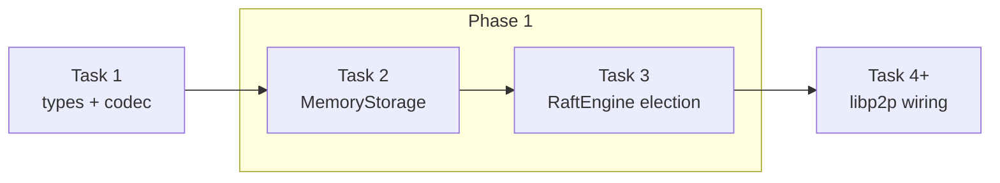

# Phase 1 — Engine election + MemoryStorage

What Phase 1 delivers, what it depends on, and how you know it is done.

**Phase 1 goal:** a **pure, unit-testable** Raft election core with in-memory storage — **no Swarm, no ConnectionHandler, no networking**.

Maps to **Task 1** (prerequisite) + **Task 2** + **Task 3** in the [implementation plan](superpowers/plans/2026-07-23-libp2p-raft.md).

---

## Where Phase 1 sits



| Phase (README) | Plan tasks | Deliverable |
|----------------|------------|-------------|
| — (prerequisite) | Task 1 | Wire types + codec |
| **1** | Task 2 + Task 3 | Storage + election engine (unit tests) |
| 0 | Task 4 | Echo RPC over libp2p |
| 2 | Task 5 | 3-node leader election |
| 3+ | Task 6–8 | Replication, snapshots, membership |

---

## Prerequisite: Task 1 — types + codec

Phase 1 cannot start until these compile and `codec_roundtrip` passes.

### Files

| Path | Responsibility |
|------|----------------|
| `Cargo.toml` | Dependencies (libp2p, serde, bincode, thiserror, byteorder, …) |
| `src/lib.rs` | Module wiring + re-exports |
| `src/error.rs` | `Error`, `RaftError`, `StorageError` |
| `src/raft/types.rs` | Core Raft types |
| `src/protocol/messages.rs` | `RaftMessage`, `WireEnvelope` |
| `src/protocol/codec.rs` | Length-delimited encode/decode |
| `src/protocol/upgrade.rs` | `PROTOCOL_NAME` stub only |
| `tests/codec_roundtrip.rs` | Round-trip test |

### Types to define

```text
NodeId, Term, Index          (u64 aliases)
Role                         Follower | Candidate | Leader
HardState                      current_term, voted_for
EntryType                      Command(Vec<u8>)  — Config comes in Phase 5
LogEntry                       index, term, entry_type
Snapshot                       last_included_index, last_included_term, conf, state_blob
RaftMessage                    RequestVote, RequestVoteResp, AppendEntries, …
WireEnvelope                   correlation_id + msg
```

### Codec contract

```text
[u32 BE length][bincode(WireEnvelope)]
```

Run: `cargo test --test codec_roundtrip`

---

## Task 2 — Storage

### Files

| Path | Responsibility |
|------|----------------|
| `src/storage/mod.rs` | `Storage` trait |
| `src/storage/memory.rs` | `MemoryStorage` |
| `tests/storage_memory.rs` | Unit tests |

### `Storage` trait

```rust
fn hard_state(&self) -> HardState;
fn entry(&self, index: Index) -> Option<LogEntry>;
fn last_index_term(&self) -> (Index, Term);   // empty log → (0, 0)
fn truncate_from(&mut self, index: Index);
fn snapshot(&self) -> Option<Snapshot>;
fn install_snapshot(&mut self, snap: Snapshot);
fn persist(
    &mut self,
    hard_state: Option<HardState>,
    entries: &[LogEntry],
) -> Result<(), StorageError>;
```

### Rules

- **`persist` is the only write path** for hard state + log appends (atomic batch in one method body).
- No separate public “append then save” sequence.
- `MemoryStorage` holds hard state, log entries, optional snapshot — all in memory.

### Tests (must pass)

1. **`persist_hard_state_and_entries_atomically`** — persist term + one entry; read back both.
2. **`truncate_from_removes_suffix`** — two entries; truncate from index 2; entry 2 gone, entry 1 remains.

Run: `cargo test --test storage_memory`

---

## Task 3 — RaftEngine election

### Files

| Path | Responsibility |
|------|----------------|
| `src/config.rs` | `RaftConfig` with timeouts |
| `src/raft/engine.rs` | `RaftEngine`, `Action`, `TickOutcome` |
| `src/raft/membership.rs` | Static voter set (minimal) |
| `src/raft/log.rs` | Minimal log helpers |
| `tests/engine_election.rs` | Unit tests |

### `RaftConfig` (for tests)

```text
node_id
voters: Vec<NodeId>
election_timeout, election_jitter (0 in tests)
heartbeat_interval
rpc_timeout, rpc_max_retries
snapshot_threshold
seed_peers (empty in unit tests)
```

### Engine API (Phase 1 scope)

```text
RaftEngine::new(config, storage)
tick(now)              → TickOutcome { actions, next_deadline }
handle_rpc(from, msg)  → Vec<Action>
handle_rpc_failure     → Vec<Action>   (ignore stale after term change)
role()                 → Role
next_deadline()        → Instant
```

### Actions (Phase 1)

```text
Send { to, msg }
Broadcast { msg }
BecomeLeader { term }
BecomeFollower { term, leader }
BecomeCandidate { term }
```

`Apply`, snapshot actions come in later phases.

### Election behavior to implement

| Event | Behavior |
|-------|----------|
| Follower election timeout | term += 1, become Candidate, vote self, `persist`, `Broadcast` RequestVote |
| Inbound RequestVote | Grant if term/log OK; `persist`; reply RequestVoteResp |
| Majority vote_granted | BecomeLeader; init empty `next_index` / `match_index` maps |
| `tick(now)` | Only when `now >= next_deadline`; return actions + next wake time |

### Explicitly out of scope for Phase 1

- AppendEntries replication (empty heartbeat stub optional)
- `propose` / commit
- Snapshots
- Membership add/remove
- `ConnectionHandler`, `RaftBehaviour`, examples

### Tests (must pass)

1. **`follower_times_out_becomes_candidate_and_requests_votes`**
   - `tick(now)` past election deadline
   - Assert `Role::Candidate`
   - Assert `Action::Send` or `Broadcast` with RequestVote

2. **`candidate_wins_majority_becomes_leader`**
   - Start election via tick
   - Feed `RequestVoteResp { vote_granted: true }` from peer 2 (self-vote already counted)
   - Assert `Role::Leader` and `BecomeLeader` action

Run: `cargo test --test engine_election`

---

## Phase 1 success checklist

- [x] `cargo test --test codec_roundtrip` — PASS
- [x] `cargo test --test storage_memory` — PASS
- [x] `cargo test --test engine_election` — PASS
- [x] `RaftEngine` has **zero** libp2p imports
- [x] No Handler / Behaviour / Swarm code required yet

---

## TDD workflow (per task)

1. Write failing test
2. Run test — expect FAIL
3. Implement minimal code
4. Run test — expect PASS
5. Commit

---

## What comes next

After Phase 1 is green:

| Next | What |
|------|------|
| Task 4 (Phase 0) | Custom Handler + echo RPC between 2 peers |
| Task 5 (Phase 2) | Wire election through Behaviour; `examples/three_node.rs` |
| Task 6 (Phase 3) | AppendEntries, propose, commit |

See also: [design spec](superpowers/specs/2026-07-23-libp2p-raft-design.md) §5 (RaftEngine), [libp2p fundamentals](libp2p-fundamentals.md) (networking layer comes after Phase 1).
